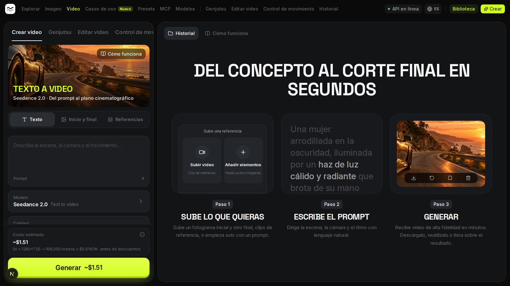
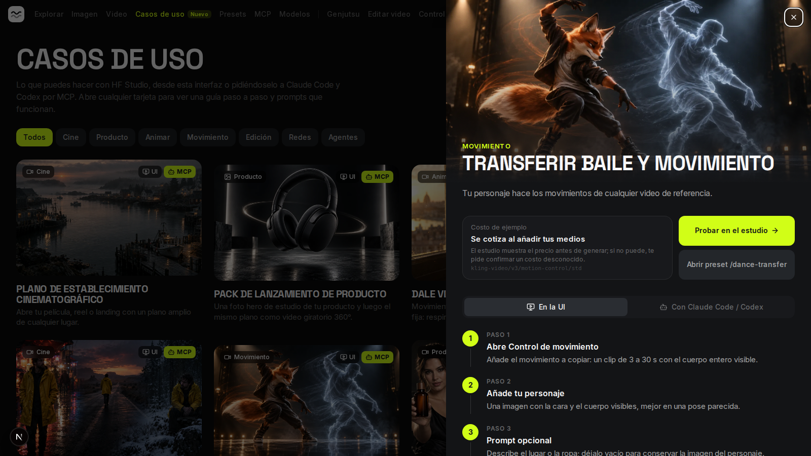
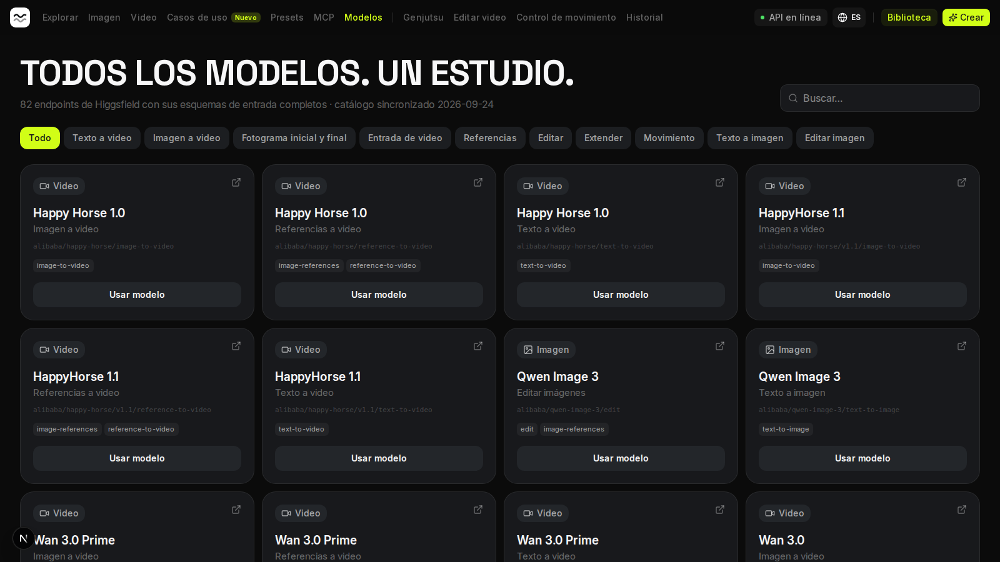

# HF Studio

Tu propio estudio de video e imagen con IA sobre la [API de Higgsfield](https://docs.higgsfield.ai): una **API** y un
**servidor MCP** para que tus agentes (Claude Code, Codex) generen por ti, y una **interfaz web** para hacerlo a mano.
Todo comparte el mismo historial.

*Your own AI video and image studio on top of the Higgsfield API: a REST API, an MCP server for coding agents and a
web UI (Spanish by default, English available).*



## Qué incluye

- **82 endpoints de Higgsfield** (66 de video, 15 de imagen y 1 de referencias personalizadas), cada uno con su JSON
  Schema sacado de la documentación oficial (`hf-studio sync-catalog`).
- **Todas las capacidades:** texto a video, imagen a video, fotograma inicial y final, videos de referencia, edición y
  extensión de video, transferencia de movimiento, cambio de objetos (Genjutsu), texto a imagen y edición de imagen.
  Se busca por capacidad, no por marca.
- **El costo siempre se ve antes de generar.** En la UI aparece junto al botón. Por MCP, generar exige el `quote_id`
  de una cotización previa de esa misma petición.
- **Trabajos asíncronos y persistentes:** validación antes de gastar créditos, deduplicación, `Idempotency-Key`, cola
  local según la concurrencia de la cuenta, sondeo con backoff, webhooks opcionales y copia local de las salidas
  (Higgsfield solo las guarda 7 días).
- **Presets** (recetas con variables), **lotes** con cotización total, **recomendador** de modelos en lenguaje
  natural (es/en) y **12 casos de uso** con tutorial paso a paso para la UI y para los agentes.
- **Interfaz bilingüe:** español por defecto e inglés con un clic.

| Casos de uso | Catálogo de modelos |
| --- | --- |
|  |  |

## Requisitos

- Python 3.12+ y [uv](https://docs.astral.sh/uv/)
- Node.js 20+ y [pnpm](https://pnpm.io/) (para la UI)
- Una clave de API de Higgsfield ([console.higgsfield.ai](https://console.higgsfield.ai)). Generar consume tus créditos.

## Puesta en marcha

```bash
git clone https://github.com/Jjat00/hf-studio.git && cd hf-studio
uv sync
cp .env.example .env                      # pega tu clave de Higgsfield en HF_API_KEY
uv run hf-studio check-credentials        # valida la clave sin gastar créditos
uv run hf-studio create-key web-ui        # clave hfs_… para la UI (se muestra una sola vez)
cp web/.env.example web/.env.local        # pega esa clave en HF_STUDIO_TOKEN
cd web && pnpm install && cd ..
./dev.sh                                  # API en :8787 (docs en /docs) y UI en :3000
```

Otros comandos: `hf-studio create-key NOMBRE`, `list-keys`, `revoke-key NOMBRE`, `sync-catalog` y `serve`.
Cada cliente (la UI, Claude Code, Codex…) tiene su propia clave `hfs_…`. Las credenciales de Higgsfield solo las
conoce la API.

## UI web (`web/`)

Next.js 16 y Tailwind 4, con un look inspirado en higgsfield.ai. El logo, el nombre y las ilustraciones son propios.

- **Páginas:** Explorar, Video (Crear: texto, fotograma inicial y final, referencias · Genjutsu · Editar video ·
  Control de movimiento), Imagen, Casos de uso, Presets, Biblioteca, Modelos y MCP.
- **Formularios:** se generan desde el `input_schema` de cada modelo, así que los 82 endpoints funcionan sin código
  específico.
- **Proxy:** el navegador solo habla con `/api/studio/*`, un proxy en el servidor de Next que añade la clave
  `hfs_…`. La clave nunca llega al cliente.
- **Casos de uso** (`/use-cases`, datos en `web/src/lib/use-cases.ts`): `?case=<slug>` abre uno y «Usar en el
  estudio» abre el estudio con `?prompt=` ya relleno.
- **Idiomas:** el idioma se guarda en la cookie `hfs-lang`, así que las URLs no cambian. Los textos están en
  `web/src/lib/i18n/dictionaries.ts` y los datos bilingües usan `l("es", "en")`. La API y el MCP siguen en inglés,
  así que la UI traduce en el cliente los presets de serie, las frases de costo y los nombres de flujo del
  catálogo. Los prompts de ejemplo y las opciones de los presets se envían en inglés.

## Conectar agentes (MCP)

Claude Code:

```bash
claude mcp add hf-studio --scope user \
  -e HF_STUDIO_URL=http://127.0.0.1:8787 -e HF_STUDIO_TOKEN=hfs_… \
  -- uv run --directory /ruta/absoluta/a/hf-studio hf-studio mcp
```

Codex (`~/.codex/config.toml`):

```toml
[mcp_servers.hf-studio]
command = "uv"
args = ["run", "--directory", "/ruta/absoluta/a/hf-studio", "hf-studio", "mcp"]
env = { HF_STUDIO_URL = "http://127.0.0.1:8787", HF_STUDIO_TOKEN = "hfs_…" }
```

Herramientas (15): `find_models`, `get_model`, `recommend_models`, `upload_media`, `estimate_cost`,
`generate`, `generate_batch`, `get_generation`, `wait_generations`, `list_generations`,
`cancel_generation`, `download_outputs`, `list_presets`, `run_preset` y `save_preset`.

**Nada se genera sin cotizar antes esa misma petición.** `estimate_cost`, y `generate_batch` o `run_preset`
con `dry_run=True`, devuelven el costo y un `quote_id`. `generate`, y los lotes y presets con `dry_run=False`,
exigen ese `quote_id` con los mismos parámetros. Cada cotización vale para una sola ejecución y dura 15 min
(se guarda en el proceso del MCP); un reintento con la misma `idempotency_key` no vuelve a cobrar. Si el precio
está incompleto (falta `input_video_seconds`, que en los lotes también puede ir por ítem en `hints`), hace falta
además `confirm_unknown_cost=True`, solo cuando el usuario acepta explícitamente un costo desconocido. El MCP no conoce las credenciales
de Higgsfield, solo su propia clave `hfs_…`.

## API REST

Todas las rutas `/v1` requieren `Authorization: Bearer hfs_…`.

| Método | Ruta | Uso |
| --- | --- | --- |
| GET | `/v1/models?capability=&output=&q=` | Catálogo filtrable (lista de capacidades incluida) |
| GET | `/v1/models/{id}` | `input_schema`, notas de uso, enlace a docs |
| POST | `/v1/uploads` (multipart `file`) | Sube jpg/png/webp/gif/mp4/wav → URL pública |
| POST | `/v1/estimate` `{model, input, hints}` | Costo antes de generar: exacto, aproximado por fórmula o pendiente de medios |
| POST | `/v1/generations` `{model, input}` | Encola; 202 nuevo, 200 si se deduplicó. Header `Idempotency-Key` |
| GET | `/v1/generations/{id}?wait=60` | Estado; espera hasta N s a que sea terminal |
| GET | `/v1/generations?ids=a,b&wait=60` | Historial, o espera a que terminen varias |
| POST | `/v1/generations/batch` | Varias generaciones; `dry_run` devuelve el costo por ítem y el total |
| GET | `/v1/recommend?task=…` | Modelos sugeridos para una tarea (es/en) con su costo |
| GET/POST/DELETE | `/v1/presets` | Recetas de serie y propias; `POST /v1/presets/{slug}/run` (con `dry_run`) |
| POST | `/v1/presets/from-generation/{id}` | Guardar una generación como preset |
| POST | `/v1/generations/{id}/cancel` | Solo en `pending`/`queued` |
| GET | `/v1/generations/{id}/files/{name}` | Copia local de la salida |

Estados: `pending` (cola local) → `submitting` → `queued` → `in_progress` → `completed` | `failed` | `nsfw` |
`canceled` | `timed_out`. Cada respuesta incluye `stage` legible, `terminal`, `elapsed_seconds` y
`correlation_id` (para soporte de Higgsfield).

Ejemplo, video entre dos imágenes:

```bash
curl -X POST localhost:8787/v1/generations -H "Authorization: Bearer $HFS" -H 'Content-Type: application/json' \
  -d '{"model":"bytedance/seedance-2.0/image-to-video",
       "input":{"image_url":"https://…/inicio.png","end_image_url":"https://…/final.png",
                "prompt":"slow dolly-in","duration":5}}'
```

## Decisiones

- **REST directo (httpx) en lugar del SDK**: el POST de generación no admite idempotencia, así que tras un
  timeout ambiguo **no se reintenta** (el trabajo queda `failed/submission_ambiguous`). El SDK reintenta
  y sondea por su cuenta; aquí ese ciclo lo gobierna el worker con estado en BD.
- **Concurrencia**: Higgsfield responde 400 al llegar al límite y no envía `Retry-After`. Los trabajos esperan en
  `pending` y se envían cuando hay cupo (`HF_MAX_CONCURRENCY`).
- **Webhooks**: sin firma documentada. El webhook solo dispara una consulta autenticada al endpoint de estado
  (no se confía en su payload). Cada trabajo lleva un token propio en la URL. El sondeo sigue como respaldo.
- **Worker en proceso**: un solo proceso basta. El reclamo atómico (`pending → submitting`) evita dobles envíos
  si se levantan varios. Un reinicio a mitad de envío marca el trabajo como ambiguo en vez de repetirlo.

## Desarrollo

```bash
uv run pytest            # Higgsfield simulado con httpx.MockTransport: no gasta créditos
uv run ruff check src tests
```

## Revisiones

El código pasó por revisiones adversariales con Codex (gpt-6-sol) hasta un veredicto de aprobado. Están en
[`docs/revisiones/`](docs/revisiones/).

## Aviso

Proyecto personal, no afiliado a Higgsfield. Usa su API pública con tu propia clave y tus créditos. Higgsfield y los
nombres de los modelos pertenecen a sus dueños.
