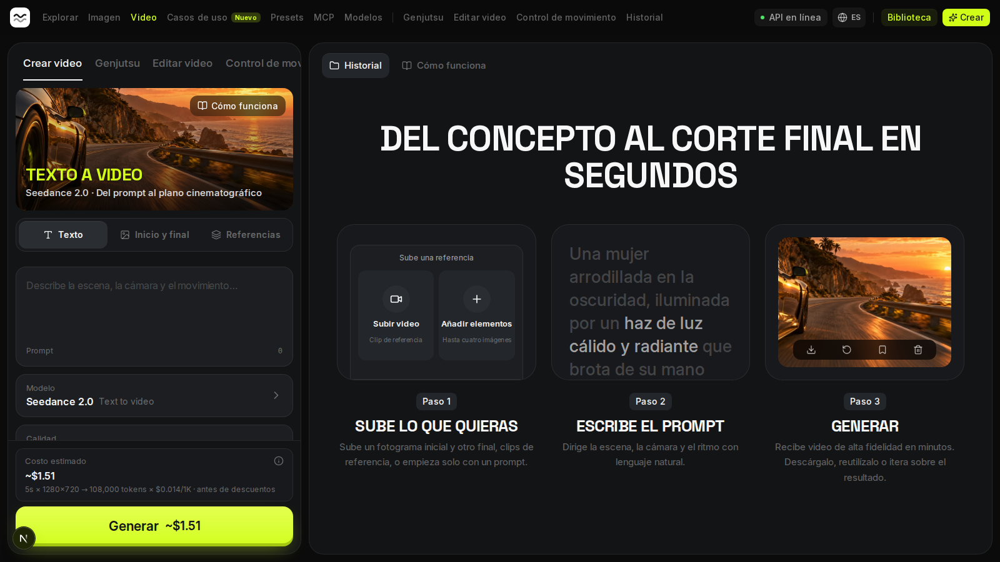
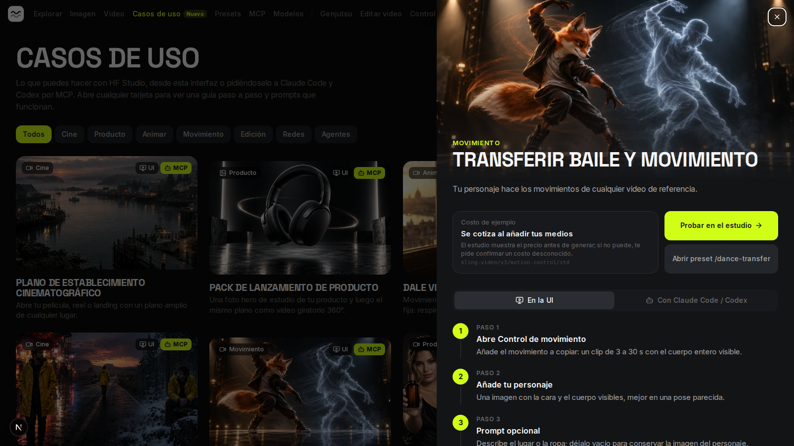
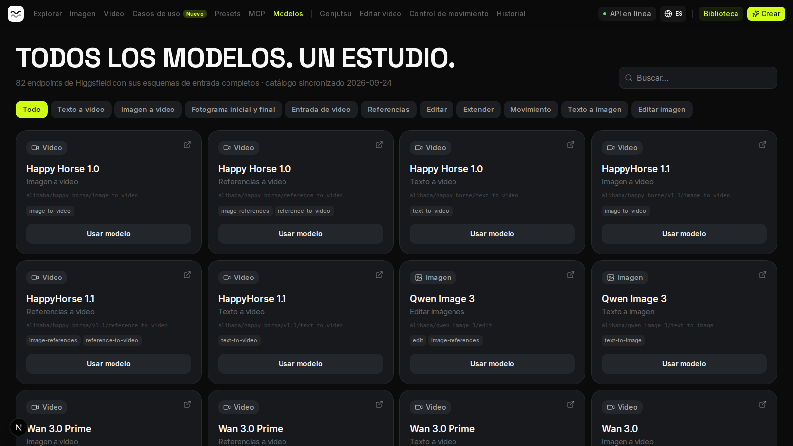

# HF Studio

[](https://github.com/Jjat00/hf-studio/actions/workflows/ci.yml)
[](https://m8ven.ai/mcp/jjat00/hf-studio)
[](LICENSE)
[](pyproject.toml)
[](#connect-your-agents-mcp)

[Español](README.es.md) · **English** · [Website and examples](https://hf-studio-gold.vercel.app)

**A self-hosted AI video, image and audio studio on top of the [Higgsfield](https://docs.higgsfield.ai) and
[ElevenLabs](https://elevenlabs.io/docs) APIs.** One backend gives you a REST API, an **MCP server** so your agents
(Claude Code, Codex, Claude Desktop, ChatGPT…) can generate for you, and a **web UI** to do it by hand. Everything
lands in the same library.

Its MCP server is built around one rule: **an agent cannot spend credits without first quoting that exact request**,
so it always has a price to show you before it generates.



## Why

- **The cheapest provider for each video:** the same model through Higgsfield, APIMart or KIE, quoted on all of
  them, with a safe fallback (see [Cheaper with more providers](#cheaper-with-more-providers)).
- **One place for 82 Higgsfield endpoints** (Seedance, Kling, Wan, Hailuo, PixVerse, LTX, Grok Imagine, Ideogram, Recraft…), searchable by what they do
  (text-to-video, first/last frame, video edit, motion transfer…) instead of by brand.
- **Agents that quote before they spend.** Every MCP tool that starts a paid run requires a single-use `quote_id` from a prior quote of
  the same request, and the server tells the agent to show you that cost and wait for your OK.
- **Persistent jobs.** Async jobs stored in a database, with validation before spending, deduplication,
  `Idempotency-Key`, a local queue that respects your account's concurrency, and local copies of every output
  (Higgsfield only keeps them for 7 days). Higgsfield jobs keep being tracked after a restart; audio jobs cut off by a
  restart are marked as failed, not resumed.

## Cheaper with more providers

The same model is often sold by several providers at very different prices. HF Studio can send each generation to
the cheapest provider that offers **the exact same model and settings**:

| Provider | Key | What it adds |
| --- | --- | --- |
| [Higgsfield](https://higgsfield.ai) | `HF_API_KEY`, required | Every catalog model, and it stores your input files (uploading is free) |
| [APIMart](https://apimart.ai) | `APIMART_API_KEY`, optional | Usually the cheapest for Seedance and Wan |
| [KIE](https://kie.ai) | `KIE_API_KEY`, optional | Usually the cheapest for Hailuo and MiniMax |

- **Quote every provider, run the cheapest.** `/v1/estimate`, the UI and `estimate_cost` show every option, the
  savings against Higgsfield and why a provider was left out (no key, no balance, or no exact equivalent for your
  settings). Prices come from each reseller's public price list, refreshed daily. On 2026-10-03, Seedance 2.0 at
  720p for 5 s cost 0.71 USD on APIMart, 1.025 on KIE and 1.51 on Higgsfield.
- **Same model, never a substitute.** A setting a provider cannot reproduce (a fixed seed, a bitrate, an aspect
  ratio…) leaves that provider out instead of being dropped.
- **Fallback without double charges.** If a provider rejects the request or the task fails without charging, the
  next one is tried on its own only if it costs the same or less than what you approved; otherwise the generation
  waits for your approval. A submission that may have reached the provider (timeout, unclear answer) is never
  retried anywhere.
- **Prices checked again before sending.** APIMart and KIE are priced from local tables, so they are re-priced right
  before every send; Higgsfield quotes are reused for 15 minutes and asked again after that. Before the first
  automatic send the whole plan is redone with current prices. The generation stops for your approval when the
  checked price goes over your approved cap, when the price becomes unknown and you did not accept an unknown cost
  for that option, or when an upfront hold (some providers hold more than they charge and refund the difference)
  goes over the hold you approved. If you accepted an unknown cost without a cap for an option, that option can run
  at whatever price it ends up having; holds are always approved separately.
- **Add a key:** `uv run hf-studio providers --add apimart` (or `kie`) asks for it, checks it for free and saves it;
  `--open NAME` opens the page where you create it, and `hf-studio providers` shows status and balances. The UI has a
  **Providers** page with the same links.
- **Add a provider (developers):** write a `Provider` subclass in `src/hf_studio/providers/` (key check, submit,
  poll, optional price list) plus its model table, and list it in `registry.py`. Setup, the UI, the MCP and the
  worker pick it up from there.

## Features

- **82 Higgsfield endpoints** (66 video, 15 image, 1 custom references), each with its JSON Schema taken from the
  official docs (`hf-studio sync-catalog`).
- **Every video and image capability:** text-to-video, image-to-video, first and last frame, reference videos, video
  edit and extend, motion transfer, object swap (Genjutsu), text-to-image and image editing.
- **ElevenLabs audio (optional):** change the voice on a segment of a video (with deep, monster and ghost effects),
  text-to-speech, sound effects, music and voice isolation.
- **Keep the original audio** when editing a video: HF Studio muxes the source audio back onto the result (free, with
  ffmpeg), handy when the model returns a silent clip.
- **Cost visible before generating:** next to the button in the UI, and required by the MCP tools (one quote per
  request). On the REST API, the ElevenLabs routes require their own quote; the Higgsfield routes offer
  `/v1/estimate` and `dry_run` and trust whoever holds the `hfs_…` key.
- **Library** in a masonry grid with everything generated from the UI and from agents (with its origin), filters and a
  detail page per result with its full configuration (model, prompt, parameters, input files and JSON).
- **Sound library:** all your ElevenLabs sounds (including voices made on their website, imported for free) sorted by
  kind (voices, screams, laughs, creatures, ambience, impacts, foley, transitions, music) with editable titles and tags,
  so you can reuse them instead of paying again.
- **Presets** (recipes with variables), **batches** with a total quote, a natural-language **model recommender**
  (English and Spanish) and **12 use cases** with step-by-step tutorials for the UI and for agents.
- **Bilingual UI:** Spanish by default, English one click away.

| Use cases | Model catalog |
| --- | --- |
|  |  |

## Requirements

Runs natively on Windows, macOS and Linux (and in WSL). CI tests the backend on all three.

- Python 3.12+ and [uv](https://docs.astral.sh/uv/)
- Node.js 20+ and [pnpm](https://pnpm.io/) (for the UI)
- [ffmpeg](https://ffmpeg.org/) with `ffprobe` (voice change, original audio and isolation; also used by the tests).
  Linux: `sudo apt install ffmpeg`. Windows: `winget install ffmpeg`. macOS: `brew install ffmpeg-full`, because the
  plain `ffmpeg` formula lacks the `rubberband` filter that the voice effects use (HF Studio finds `ffmpeg-full` on
  its own and warns at startup if the filter is missing).
- A Higgsfield API key ([console.higgsfield.ai](https://console.higgsfield.ai)). Generating spends your credits.
- Optional: APIMart and KIE API keys, to make videos cheaper (see [Cheaper with more providers](#cheaper-with-more-providers)).
- Optional: an ElevenLabs API key ([elevenlabs.io/app/settings/api-keys](https://elevenlabs.io/app/settings/api-keys))
  for voice, effects and music. Pay-as-you-go balance or a plan both work.

## Quick start

```bash
git clone https://github.com/Jjat00/hf-studio.git
cd hf-studio
./dev.sh        # macOS, Linux, WSL
.\dev          # Windows (cmd or PowerShell)
```

Both are shortcuts for `uv run hf-studio start`, which works the same on Windows, macOS and Linux.

The first run asks for your Higgsfield key (and, optionally, your ElevenLabs key), validates it without spending
credits, creates `.env` and the UI key, installs the dependencies and starts everything. To add the ElevenLabs key
later, put it in `ELEVENLABS_API_KEY` in `.env` and restart.

- Web UI: http://localhost:3000
- API and interactive docs: http://127.0.0.1:8787/docs

Only want to use it from your agents? `./dev.sh api` (Windows: `.\dev api`, or anywhere
`uv run hf-studio start --api-only`) starts just the API, no Node.js needed. Then connect your agent
in one line (see [Connect your agents](#connect-your-agents-mcp)):

```bash
uv run hf-studio connect claude-code     # or: codex, claude-desktop, json
```

Setting it up with an AI agent? Point it to [AGENTS.md](AGENTS.md).

### Commands

| Command | Use |
| --- | --- |
| `hf-studio start [--api-only]` | Sets up on the first run and starts the API and UI (or only the API); `./dev.sh` and `dev.cmd` run it |
| `hf-studio setup [--no-input]` | First-run setup: `.env`, key check and UI key (`start` runs it) |
| `hf-studio connect CLIENT [--print]` | Registers the MCP server in `claude-code` or `codex`, or prints the config (`claude-desktop`, `json`) |
| `hf-studio serve` | Starts the API and the worker |
| `hf-studio mcp` | MCP server over stdio |
| `hf-studio create-key NAME` · `list-keys` · `revoke-key NAME` | One `hfs_…` key per client (UI, Claude Code, Codex…) |
| `hf-studio see-all NAME [--off]` | Lets a client see and manage everyone's generations (meant for the UI) |
| `hf-studio keep-source-audio ID` | Puts the source video's audio on an existing edit |
| `hf-studio providers [--add NAME \| --open NAME]` | Providers' status and balance; adds a key or opens the page to create it |
| `hf-studio check-credentials` | Validates the Higgsfield key without spending |
| `hf-studio sync-catalog` | Regenerates `catalog.json` from docs.higgsfield.ai |

### Keys and access

Each client has its own `hfs_…` key and, by default, only sees its own generations. Only the API knows the Higgsfield
and ElevenLabs credentials.

> **Warning:** the UI proxy does not authenticate visitors, so with `see-all` anyone who can reach the Next server can
> see, delete and launch generations. `pnpm dev` and `pnpm start` listen on `127.0.0.1` only; do not expose it to
> other machines without putting authentication in front.

## Connect your agents (MCP)

With the API running (`hf-studio start`, `./dev.sh` or `.\dev`), the easiest way is to **ask your agent to connect
itself**. Paste this into Claude Code, Codex or any other agent (the UI's MCP page has it with your real path filled in):

```text
Connect yourself (this agent) to the HF Studio MCP server. It is installed at: /absolute/path/to/hf-studio

1. Check that its API is running: GET http://127.0.0.1:8787/health must answer {"ok": true, ...}. If it does not, ask me to start it with `uv run hf-studio start` in that folder and wait.
2. Register it with the command for your client:
   - Claude Code: uv run --directory '/absolute/path/to/hf-studio' hf-studio connect claude-code
   - Codex: uv run --directory '/absolute/path/to/hf-studio' hf-studio connect codex
   - Any other MCP client: uv run --directory '/absolute/path/to/hf-studio' hf-studio connect json, and add the config it prints to your MCP configuration.
   The command creates a key just for you. If it says hf-studio is already registered, ask me before removing the old one. If your sandbox does not let you run it, show me the command so I can run it.
3. Tell me to restart you so you load the tools.
4. Read the "Use it through MCP" section of the AGENTS.md in that folder. Key rule: before generating, quote the cost, tell me and wait for my OK.
```

Or do it yourself: one command creates a key for the agent and registers the server:

```bash
uv run hf-studio connect claude-code     # runs `claude mcp add` for you
uv run hf-studio connect codex           # runs `codex mcp add` for you
uv run hf-studio connect claude-desktop  # prints the JSON for claude_desktop_config.json
uv run hf-studio connect json            # prints the config for any other stdio MCP client
```

With `--print`, it prints the command or config (with a new key) instead of registering it. If the agent's CLI is not
installed, nothing is registered: it prints the command, with its new key, to run where that CLI is. From WSL,
`claude-desktop` prints a config that enters WSL through `wsl.exe`, for when HF Studio runs in WSL and Claude
Desktop on Windows. Restart the client afterwards so it loads the tools. Each connection gets its
own revocable `hfs_…` key (`codex`, `codex-2`…; see `hf-studio list-keys`, `revoke-key NAME`); existing keys are never
touched. If the agent already has `hf-studio`, `connect` stops: remove it first (`claude mcp remove hf-studio`). By hand, the
server is `uv run --directory /absolute/path/to/hf-studio hf-studio mcp` with `HF_STUDIO_URL=http://127.0.0.1:8787`
and `HF_STUDIO_TOKEN=hfs_…` in its environment.

Tools (27). Every tool declares all four MCP hints (`readOnlyHint`, `destructiveHint`, `idempotentHint`,
`openWorldHint`), and the ones that spend credits say so in their title, so clients can warn you before calling them.

| Group | Tools |
| --- | --- |
| Models | `find_models`, `get_model`, `recommend_models` |
| Generate | `upload_media`, `estimate_cost`, `generate`, `generate_batch` |
| Tracking | `get_generation`, `wait_generations`, `list_generations`, `cancel_generation`, `download_outputs`, `approve_fallback` |
| Providers | `providers_status` |
| Presets | `list_presets`, `run_preset`, `save_preset` |
| Voice (ElevenLabs) | `list_voices`, `change_voice` |
| Audio (ElevenLabs) | `text_to_speech`, `sound_effect`, `compose_music`, `isolate_voice`, `elevenlabs_account` |
| Sound library | `list_sounds`, `label_sound`, `import_elevenlabs_history` |

**No MCP tool generates without quoting that same request first.** `estimate_cost`, and `generate_batch` or
`run_preset` with `dry_run=True`, return the cost and a `quote_id`. `generate`, and batches and presets with
`dry_run=False`, require that `quote_id` with the same parameters. The ElevenLabs tools follow the same pattern:
without `quote_id` they return the cost; with it, they generate. Each quote is good for one run and lasts 15 minutes;
a retry with the same `idempotency_key` is not charged again. If the price is incomplete (missing
`input_video_seconds`, which in batches can also go per item in `hints`), `confirm_unknown_cost=True` is required too,
only when the user explicitly accepts an unknown cost. **Approving a pending generation is a separate step without a
`quote_id`:** a generation in `awaiting_approval` (its provider failed without charging, or the price went over what
was approved) shows the new price in `cost_usd` and any upfront hold in `reserve_usd`; with the user's OK,
`approve_fallback` takes `max_usd` (that price), `max_reserve_usd` (that hold) or, only if the user accepts an unknown
cost, `accept_unknown_cost=True` (without `max_usd` it has no cap; with it, the cap still rules once the price is
known). HF Studio quotes again when approving and answers 409 with the current price if it went up. `get_model` also returns `studio_notes`, HF Studio warnings
such as `generate_audio=false` giving a silent video on an edit and how to keep the original audio (`generate` with
`keep_source_audio=true`). The MCP server never sees the Higgsfield or ElevenLabs credentials, only its own `hfs_…`
key. It cannot check that a person actually saw the price: showing it and waiting for an OK is up to the agent,
which the server instructions require.

## Web UI (`web/`)

Next.js 16 and Tailwind 4, with a look inspired by higgsfield.ai. The logo, name and illustrations are original.

- **Pages:** Explore, Image, Video (Create: text, first and last frame, references · Genjutsu · Edit video · Motion),
  Voice, Audio, Sound library, Use cases, Presets, Library (with detail at `/history/<id>`), Models and MCP.
- **Forms** are generated from each model's `input_schema`, so all 82 endpoints work without model-specific code.
- **Voice** (`/voice`): pick a video, mark the segment on the timeline, search a voice (your account or the ElevenLabs
  public library, with preview), add an effect and choose how much of the original audio stays.
- **Audio** (`/audio`): text-to-speech (expressive v3, stable v2 or cheap Flash, with language), sound effects, music
  and voice isolation from a video or audio file.
- **Proxy:** the browser only talks to `/api/studio/*`, a proxy on the Next server that adds the `hfs_…` key. The key
  never reaches the client.
- **Languages:** stored in the `hfs-lang` cookie, so URLs do not change. The API and the MCP server stay in English.

## REST API

Every `/v1` route requires `Authorization: Bearer hfs_…`. Interactive docs at `http://127.0.0.1:8787/docs`.

| Method | Route | Use |
| --- | --- | --- |
| GET | `/v1/models?capability=&output=&q=` | Filterable catalog (capability list included) |
| GET | `/v1/models/{id}` | `input_schema`, usage notes, `studio_notes`, docs link |
| POST | `/v1/uploads` (multipart `file`) | Uploads jpg/png/webp/gif/mp4/wav → public URL |
| POST | `/v1/estimate` `{model, input, hints}` | Cost before generating: exact, approximate by formula or pending media |
| POST | `/v1/generations` `{model, input, keep_source_audio}` | Enqueues; 202 new, 200 if deduplicated. `Idempotency-Key` header |
| GET | `/v1/generations/{id}?wait=60` | Status; waits up to N s for a terminal state |
| GET | `/v1/generations?ids=a,b&wait=60` | History, or wait for several to finish |
| POST | `/v1/generations/batch` | Several generations; `dry_run` returns cost per item and total |
| POST | `/v1/generations/{id}/cancel` | Only in `pending`/`queued` |
| DELETE | `/v1/generations/{id}` | Deletes a finished generation and its local copy |
| GET | `/v1/generations/{id}/files/{name}` | Local copy of the output |
| GET | `/v1/recommend?task=…` | Suggested models for a task (en/es) with their cost |
| GET/POST/DELETE | `/v1/presets` | Built-in and custom recipes; `POST /v1/presets/{slug}/run` (with `dry_run`) |
| POST | `/v1/presets/from-generation/{id}` | Save a generation as a preset |
| GET | `/v1/voice/status` | ElevenLabs configured?, plan and remaining credits |
| GET | `/v1/voice/voices?search=&library=` | Account voices or the public library |
| POST | `/v1/voice/estimate` · `/v1/voice/changes` | Voice change on a segment: quote (`voice_quote`) and run with it |
| GET/PATCH | `/v1/sounds?category=&q=` · `/v1/sounds/{id}` | Sound library with counts per category; fix title, category and tags |
| POST | `/v1/sounds/import-elevenlabs` | Imports the voices in your ElevenLabs history (free) |
| POST | `/v1/audio/{service}/estimate` · `/v1/audio/{service}` | `text-to-speech`, `sound-effects`, `music`, `voice-isolator`: quote (`audio_quote`) and run with it |

States: `pending` (local queue) → `submitting` → `queued` → `in_progress` → `completed` | `failed` | `nsfw` |
`canceled` | `timed_out`. Every response includes a readable `stage`, `terminal`, `elapsed_seconds` and
`correlation_id` (for Higgsfield support). ElevenLabs jobs live in the same table and use the same
`/v1/generations` routes.

Example, a video between two images:

```bash
curl -X POST localhost:8787/v1/generations -H "Authorization: Bearer $HFS" -H 'Content-Type: application/json' \
  -d '{"model":"bytedance/seedance-2.0/image-to-video",
       "input":{"image_url":"https://…/start.png","end_image_url":"https://…/end.png",
                "prompt":"slow dolly-in","duration":5}}'
```

## Design decisions

- **Plain REST (httpx) instead of the SDK:** the generation POST is not idempotent, so after an ambiguous timeout it
  is **not retried** (the job becomes `failed/submission_ambiguous`). The worker owns the polling loop, with state in
  the database.
- **Concurrency:** Higgsfield answers 400 at the limit and sends no `Retry-After`. Jobs wait in `pending` and are sent
  when there is room (`HF_MAX_CONCURRENCY`).
- **Webhooks:** no documented signature, so a webhook only triggers an authenticated status check (its payload is not
  trusted). Each job carries its own token in the URL. Polling stays as a fallback.
- **In-process worker:** one process is enough. The atomic claim (`pending → submitting`) prevents double submissions
  if several run. A restart mid-submission marks the job as ambiguous instead of repeating it.
- **Media opened by ffmpeg:** only your own uploads or outputs, and only over `file` and `https` (no arbitrary URLs,
  to avoid SSRF).

## Development

```bash
uv run pytest            # Higgsfield and ElevenLabs are mocked with httpx.MockTransport: no credits spent
uv run ruff check src tests
cd web && pnpm lint && pnpm exec next typegen && npx tsc --noEmit
```

The code went through 13 rounds of adversarial review with Codex; the reports are in
[`docs/revisiones/`](docs/revisiones/) (in Spanish).

## Contributing

Issues and pull requests are welcome. If HF Studio is useful to you, a star helps other people find it.

## License

[MIT](LICENSE).

Personal project, not affiliated with Higgsfield or ElevenLabs. It uses their public APIs with your own keys and
credits. Higgsfield, ElevenLabs and the model names belong to their owners.
